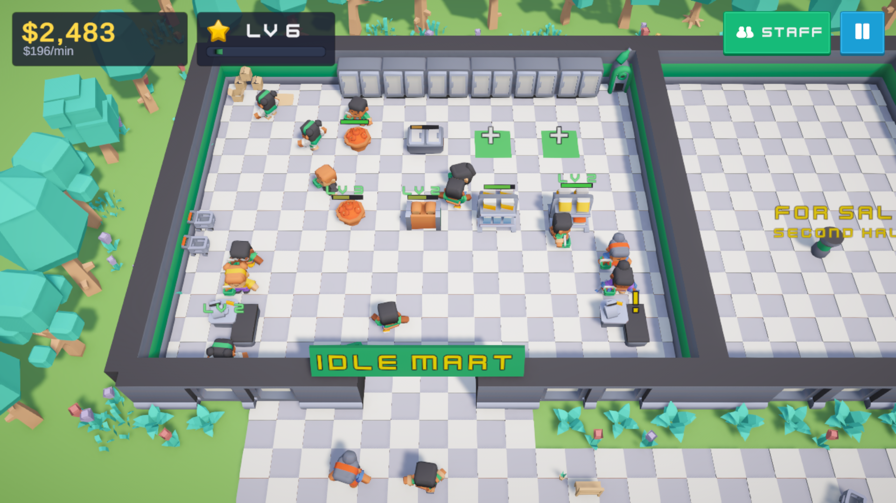
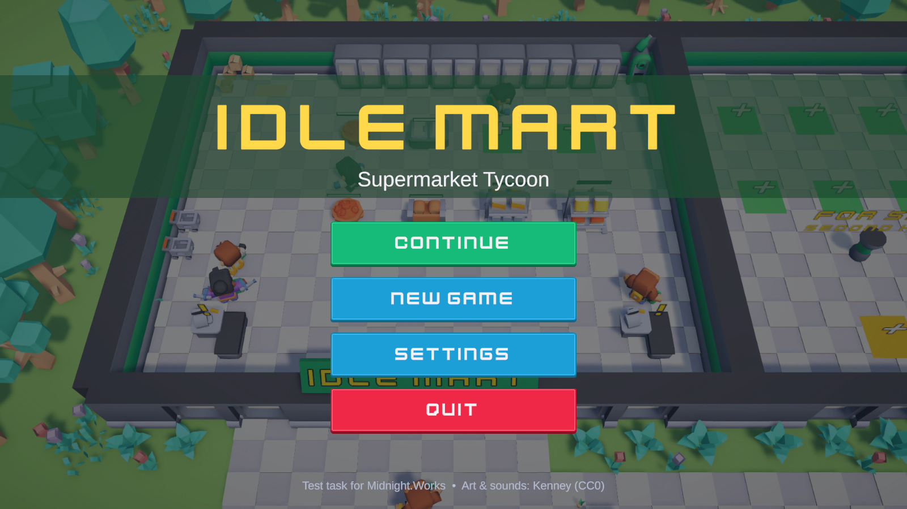

# Idle Mart — Supermarket Tycoon

A small 3D Idle Tycoon made as a test task for **Midnight.Works (Unity Developer)**.
Build shelves and checkouts, serve customers, hire staff, expand the store and earn money even while the game is closed.



> **RU:** Тестовое задание — 3D Idle Tycoon «супермаркет». Unity 6000.3.17f1, URP, только нативные пакеты Unity, бесплатные ассеты Kenney (CC0). Ниже — как запустить, управление и устройство проекта.

- **Unity:** 6000.3.17f1 (URP)
- **Packages:** only native Unity packages — uGUI + TextMeshPro, AI Navigation, Input System, Test Framework. No Zenject, DOTween or other third-party code.
- **Art & sounds:** [Kenney](https://kenney.nl) Mini Market, Mini Characters, Food Kit, Furniture Kit, Car Kit, Nature Kit, UI Pack, Game Icons, Kenney Fonts, Interface Sounds, Music Jingles (all CC0). Background music is synthesised by the project itself (`Idle Mart → Generate Music Loop`).

## How to run

1. Open the project in Unity **6000.3.17f1**.
2. Open `Assets/_Project/Scenes/Boot.unity` and press **Play** (Boot → loading screen → main menu → game).
   The Game scene can also be played directly for quick testing.

A Windows build can be made with `Idle Mart → Build Windows Player` (→ `Builds/IdleMart/IdleMart.exe`; the `-skipmenu` argument opens the game directly).



## Controls

| Action | Input |
| --- | --- |
| Pan camera | Drag with left mouse button, or WASD / arrow keys |
| Zoom | Mouse wheel |
| Build / inspect | Click a green (shelf) or yellow (checkout) **+** tile, or any built object |
| Serve a customer by hand | Click a checkout showing **$** |
| Restock a shelf by hand | Click the shelf |
| Staff & marketing | **Staff** button (top-right) |
| Pause / settings | **II** button or **Esc** |

## Gameplay

- **Core loop:** customers come in with a shopping list, walk to shelves, take items, queue at a checkout and pay. Money and XP buy more shelves, upgrades, staff and expansions → more customers.
- **Manual → automated:** at first you serve customers and refill shelves by clicking. Hire **cashiers** (per checkout) and **stockers** (carry goods from the storage room) to automate the store.
- **Build system:** predefined slots; 6 shelf types (fruits, bread, groceries, snacks, drinks, frozen) + checkouts. Every object has 5 levels (capacity, price, service speed) shown by a level badge. Shelves can be sold (50% refund) to make room for better products.
- **Expansions:** *Parking lot* (more customers) and *Second hall* (6 shelf slots + a checkout; the dividing wall disappears and the NavMesh opens up).
- **Progression:** store level from XP. Levels unlock products, expansions, more staff and bring more customers.
- **Offline income:** on return, the game pays 50% of your recent income rate for the time away (capped at 2 h) and shows a *Welcome back* popup.
- **Extra systems:** ad campaigns (×2 customers for 60 s), customer speech bubbles when a product is sold out ("No bread!").
- **Feedback:** coins fly from the checkout into the money counter, customers carry baskets, objects under the cursor are highlighted, build puffs, sounds and music.
- **Save:** automatic every 30 s, on pause, on quit and when returning to the menu.

## Project structure

```
Assets/_Project
├─ Art/            Kenney models (+ generated materials, animator controller)
├─ Audio/          Kenney sounds + generated music loop
├─ Configs/        ScriptableObject balance data (products, buildables, expansions, GameConfig)
├─ Prefabs/        Generated prefabs (buildables, characters, FX, UI)
├─ Scenes/         Boot, MainMenu, Game
├─ Scripts/
│  ├─ Runtime/     IdleMart.Runtime assembly
│  │  ├─ Core/         GameBootstrap (composition root), GameServices, camera, input, scene loading
│  │  ├─ Economy/      Wallet, IncomeTracker, UpgradeMath, OfflineIncome   (pure C#)
│  │  ├─ Progression/  LevelTable, PlayerProgress                          (pure C#)
│  │  ├─ Save/         SaveData, SaveService, FileSaveStorage              (pure C#)
│  │  ├─ Configs/      ScriptableObject definitions
│  │  ├─ World/        Store, BuildSlot, BuiltObject → Shelf / Checkout, ExpansionZone, WorldFx
│  │  ├─ AI/           CustomerAI, StockerAI, CharacterMotor, CustomerSpawner, StaffService
│  │  ├─ UI/           HUD, ContextPanel, StaffPanel, GameUI, MainMenu, UiTween (own tweener)
│  │  └─ Settings/     SettingsService (PlayerPrefs), AudioService
│  └─ Editor/      IdleMart.Editor assembly: content / scene / UI builders, music generator
└─ Tests/          EditMode (55) + PlayMode (3) NUnit tests
```

### Architecture

- **Composition root instead of a DI framework.** `GameBootstrap` creates `GameServices` (wallet, progress, income tracker, config) and passes it explicitly to scene systems (`Store`, `CustomerSpawner`, `StaffService`, UI). No hidden globals for game state.
- **Pure logic is separate from MonoBehaviours.** Economy, progression, offline income and save/load are plain C# classes; time and storage are behind `IClock` / `ISaveStorage`, so they are covered by EditMode tests.
- **Data-driven.** All balance lives in ScriptableObjects. A new shelf type or product is a new asset (+ prefab), no code changes. `BuildableConfig` holds cost curves and per-level stats.
- **Events for decoupling.** `Wallet.Changed`, `PlayerProgress.LevelUp`, `GameServices.StoreChanged`, `BuiltObject.Changed` drive the UI; gameplay never references UI.
- **AI = explicit state machines** on top of `NavMeshAgent` (`CustomerAI`: decide → walk to shelf → pick up → queue → pay → leave; `StockerAI`: find emptiest shelf → storage → carry → restock). Locked areas are baked walkable and blocked with carving `NavMeshObstacle`s until bought.
- **Save system** without third-party assets: versioned `SaveData` DTO → `JsonUtility` → atomic write (temp file + replace). Loaded values are sanitised; corrupt, missing or newer-version saves fall back to a new game, and a save that fails to restore is kept as `save.json.bak` instead of being overwritten.

### Reproducible content

Scenes, prefabs, configs and UI are generated by editor scripts, so the whole setup is reviewable as code:

- `Idle Mart → Build Everything` — rebuilds content, music, Boot/MainMenu/Game scenes and all UI.
- Existing config assets keep their tuned values when content is rebuilt.

## Tests

`Window → General → Test Runner`:

- **EditMode (55):** wallet, upgrade math, income tracking, offline income, levels, progress, save/load (incl. corrupt or edited files), config formulas, number formatting.
- **Balance simulation** (`BalanceSimulation`, explicit): a bot plays 15 game minutes at ×20 like an active player and writes a per-minute progression report to `Logs/balance.txt`. The current numbers were tuned with it (level 6 in ~12 minutes, income growing from ~$120 to ~$500 per minute).
- **PlayMode (3):** on the real Game scene — customers buy and pay a cashier, a stocker refills an empty shelf, save → reload restores the store. The player's own save is backed up and restored by the tests.

## Possible next steps

Object pooling for customers/FX, localisation, more expansions and product types, daily goals, mobile touch controls.
